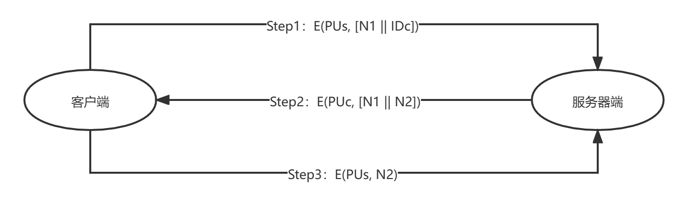
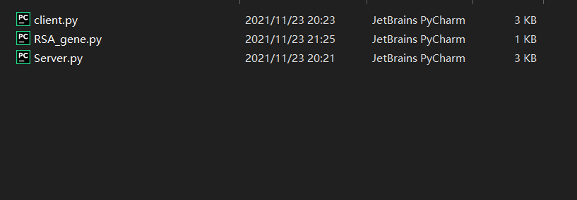
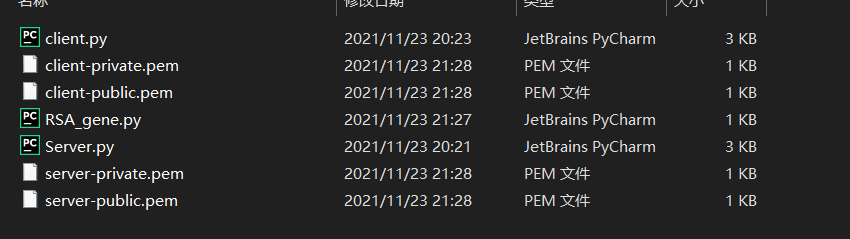
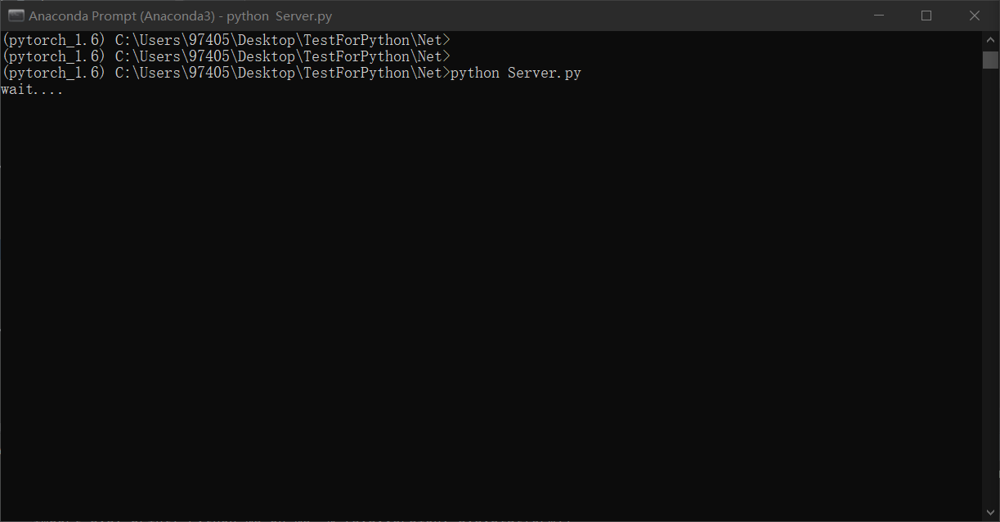
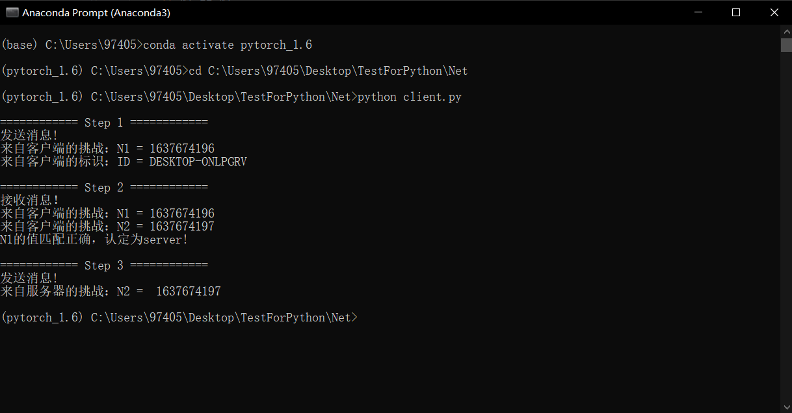
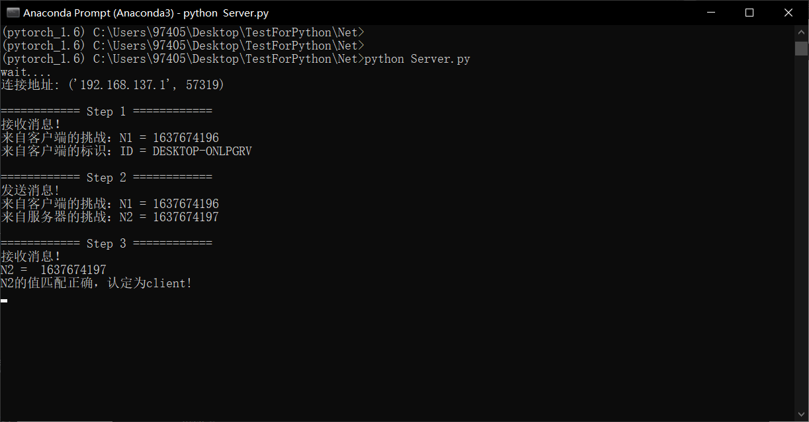

# 身份认证系统

## 1 实现原理

*注：本原理参照课本$P_{86}$页中基于公钥加密的双向认证*



​																			图：1.1 原理图示

### Step 1

由客户端向服务器端**发起连接，表明身份**。

#### 客户端：

通过服务器端发布在网络中的公钥 $PU_{s}$来加密客户端的挑战与标识。其中以当前发送时的时间戳作为挑战$N1$，将当前客户端的Hostname作为$ID_{c}$.

#### 服务器端：

接受来自客户端的消息. 通过服务器的私钥解密来自客户端的加密信息。得到来自时间戳的挑战$N1$		

### Step 2

由服务器端向客户端发启认证。

#### 服务器端：

发送当前服务器的挑战$N2$与先前来自客户端的挑战$N1$ 。其中当前发送时的时间戳作为挑战$N2$。

#### 客户端：

接收到来自服务器端的挑战$N2$，以及先前发送的挑战$N1$，并且做出比较，当两次的$N1$相同时，则认为对方是我们的目的服务器，认证成功，反之认证失败。

### Step 3

由客户端向服务器端发起认证。

#### 客户端：

发送先前收到的来自服务器的挑战$N2$，从而表明自己的身份。

#### 服务器端：

匹配接收到的挑战$N2$是否与自己先前发送的挑战相同，相同则认证成功，反之认证失败。

## 2 测试步骤

*注意：直接在pycharm最方便。。*

### Step 1

生成当前测试的服务器端、客户端的公私钥。

```shell
python RSA_gene.py
```





### Step 2

打开服务器端。

```shell
python Server.py
```



### Step 3

打开客户端。

```shell
python client.py
```



## 3 运行结果



